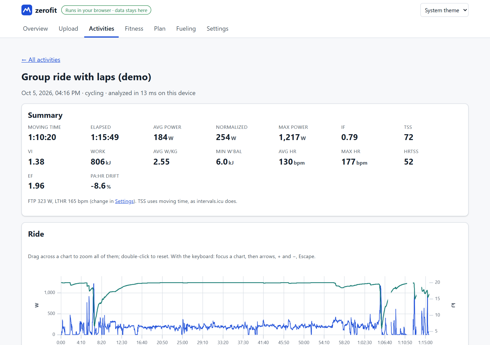
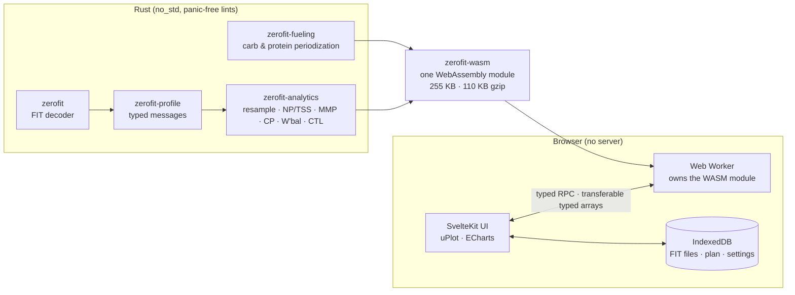

# zerofit

**Ride analysis that never leaves your browser.** Rust crates for FIT
activity files, from the binary protocol up to training metrics and
fueling plans, compiled to WebAssembly and run entirely client-side.

**Live demo: https://ondemous.github.io/zerofit/** (the demo data loads on
first visit, so there's nothing to upload)

[](https://ondemous.github.io/zerofit/)

`zerofit` is a zero-copy, `no_std`, panic-free FIT decoder, 20–28x faster
than the `fitparser` crate with zero allocations. On top of it:

- **`zerofit-analytics`** turns rides into the numbers training platforms
  show: NP, TSS, the power curve, CP/W′, W′ balance and CTL/ATL. Every
  formula is documented with its source, and the results are validated
  against intervals.icu.
- **`zerofit-fueling`** turns planned training into carbohydrate and
  protein targets, using the published sports-nutrition consensus.

All three run in a Web Worker as one 110 KB (gzipped) WebAssembly module,
behind a SvelteKit app with no server, no accounts and no tracking.
Analyzing a 4-hour ride takes 70 ms in the browser.

## Architecture



| Crate | What it is | crates.io |
|---|---|---|
| [`zerofit`](crates/zerofit) | The FIT protocol: headers, CRCs, definitions, data messages, base types. Slice decoder, streaming decoder, minimal encoder. | [zerofit](https://crates.io/crates/zerofit) (not yet published) |
| [`zerofit-profile`](crates/zerofit-profile) | The FIT profile, generated from the FIT SDK: typed `record`, `lap`, `session`, ... with scaling, units and enums; developer fields. | [zerofit-profile](https://crates.io/crates/zerofit-profile) (not yet published) |
| [`zerofit-analytics`](crates/zerofit-analytics) | Training metrics on 1 Hz streams: resampling rules, NP, IF, TSS, hrTSS, decoupling, zones, mean-maximal power, CP/W′, W′bal, CTL/ATL/TSB, eFTP; structured workouts with `.zwo`/FIT export. | [zerofit-analytics](https://crates.io/crates/zerofit-analytics) (not yet published) |
| [`zerofit-fueling`](crates/zerofit-fueling) | Rules-based carbohydrate and protein periodization (ACSM/IOC consensus): daily targets scaled by load, pre-ride, in-ride and recovery feeds, a day timeline. | [zerofit-fueling](https://crates.io/crates/zerofit-fueling) (not yet published) |
| [`zerofit-wasm`](crates/zerofit-wasm) | All of the above as one WebAssembly module for the app (internal). | — |
| [`web/`](web) | The client-side app: upload, activities, activity detail, fitness, plan, fueling, settings. | — |

```rust
use zerofit::{Decoder, Record};
use zerofit_profile::Message;

let bytes = std::fs::read("ride.fit")?;
for record in Decoder::new(&bytes) {
    if let Record::Data(msg) = record? {
        match Message::new(msg) {
            Message::Record(r) => println!("{:?} bpm, {:?} m/s", r.heart_rate(), r.speed()),
            Message::Session(s) => println!("{:?} m in {:?} s", s.total_distance(), s.total_timer_time()),
            _ => {}
        }
    }
}
```

## The numbers

Everything below was measured in this repository, on an Intel Core Ultra 7
165U laptop unless noted.

**Decoder vs `fitparser`** (criterion, details [below](#performance)):

| Fixture | zerofit: decode + scale every field | fitparser 0.11 | Speed-up | Allocations (zerofit / fitparser) |
|---|---:|---:|---:|---:|
| `icu_intervals` (334 KiB) | 68.4 MiB/s | 2.42 MiB/s | 28x | 0 / 580,800 |
| `wahoo_elemnt` (933 KiB) | 77.0 MiB/s | 2.72 MiB/s | 28x | 0 / 1,581,064 |
| `icu_laps` (116 KiB) | 78.8 MiB/s | 3.24 MiB/s | 24x | 0 / 182,524 |

**Analytics vs intervals.icu**: these are the values intervals.icu wrote into its own FIT
export, using the FTP it used (323 W). Full table and the investigation of every
difference in the [analytics README](crates/zerofit-analytics/README.md#validation-against-intervalsicu):

| Ride | Work | Avg power | NP | IF | TSS |
|---|---:|---:|---:|---:|---:|
| `icu_laps` | **0.000 %** | −0.07 % | −0.77 % | −0.83 % | −0.69 % |
| `icu_intervals` | +0.007 % | −0.31 % | +0.05 % | −0.01 % | +1.45 % |

**Analytics speed** (criterion): a full analysis of a 4-hour ride takes 55.6 ms. The
exact power curve for every duration of a 6-hour ride takes 75 ms (about 3 G
windows/s). CTL/ATL over three years takes 11.7 µs.

**In the browser** ([web README](web/README.md#measurements-2026-10-08)):

| | |
|---|---|
| WASM module (LTO + `wasm-opt -Oz`) | 255 KB raw / 110 KB gzip (from 364 / 123 KB with defaults) |
| Analyze a 4 h ride in the worker (Chromium, median of 5) | 70 ms (122 ms from file selection to result on screen) |
| Lighthouse, landing page (mobile / desktop) | Performance 100 / 100 · Accessibility 100 · Best practices 100 · SEO 100 |
| Lighthouse, deep pages on a cold first visit (mobile) | Performance 72–98 · Accessibility 100 |
| axe-core (WCAG 2.1 A/AA), every page, light and dark | 0 violations |

**Tests**: run `cargo test --workspace --all-features`, then `cd web && npm run test:e2e`.
They cover unit tests, property tests and fixture tests across every
crate, FitCSVTool ground truth, 96 generated corruption cases, three fuzz
targets, and Playwright flows with accessibility checks.

## Decoder features

- **Zero-copy, zero-allocation decoding.** `Decoder` is an `Iterator` over a
  `&[u8]`; every message borrows from it. Definitions live in a fixed
  16-slot table. Field values are decoded lazily with the right byte order.
- **Streaming.** `ReadDecoder` decodes from any `std::io::Read` with a
  bounded buffer (64 KiB plus the largest record), using the same record
  parser, so both decoders report identical errors at identical offsets.
- **Complete protocol coverage.** 12- and 14-byte headers, header and file
  CRC-16, both byte orders, all 17 base types with invalid sentinels,
  arrays, strings, compressed-timestamp headers with rollover, developer
  fields, chained files.
- **Typed profile layer.** Generated from the FIT SDK's `Profile.xlsx` for
  `file_id`, `record`, `lap`, `session`, `event`, `device_info`, `activity`
  and `hrv`: `record.speed()` returns metres per second as `f64`,
  `session.sport()` a `Sport` enum. Developer fields (Connect IQ data
  fields) are resolved by name and units.
- **Never panics.** Library code is compiled with lints that deny
  `unwrap`, `expect`, `panic!`, slice indexing and unchecked arithmetic;
  `unsafe` is forbidden.
- **Precise errors.** `Error` is `Copy` plain data: what went wrong and the
  absolute byte offset.
- **Encoder.** Rewrite a decoded file with correct CRCs, byte for byte.
- **Tools.** `fit-dump` (FIT to JSON or CSV) and `fit-anonymize` (move GPS
  tracks, clear serial numbers, re-encode).

```sh
cargo run -p zerofit-profile --example fit-dump -- --csv ride.fit
cargo run -p zerofit --example fit-anonymize -- ride.fit shareable.fit
```

## `no_std`

With `default-features = false`, `zerofit` is `#![no_std]`, never allocates
and builds for bare-metal targets (CI checks `thumbv7em-none-eabihf`).
`zerofit-profile` is `no_std` too.

| Constraint | Consequence |
|---|---|
| No `std::io` in core | `ReadDecoder` is behind the `std` feature; `no_std` users decode slices |
| No `alloc` | Definitions borrow the input, so the zero-allocation API needs the file (or each chained file) in one buffer |
| Errors can't hold `io::Error` or `String` | The core `Error` is `Copy` data (kind and byte offset); I/O errors live in the std-only `ReadError` |
| No `HashMap` | Fixed arrays; developer-field resolution needs `alloc` (`BTreeMap`) |
| No float functions such as `round` in `core` | Profile scaling uses only `/` and `-` |

Features: `zerofit/std` (default; `ReadDecoder`, implies `alloc`),
`zerofit/alloc` (`encode::Encoder`), `zerofit-profile/alloc`
(`developer::DeveloperData`).

## Performance

### Decoder

Measured with `cargo bench -p zerofit-bench` (criterion, median of 20
samples) on an Intel Core Ultra 7 165U laptop (Windows 11, AC power),
`rustc 1.98.1`, release profile, files already in memory. Throughput in MiB/s
of FIT file; messages per second in parentheses.

| Fixture | Size | Messages | zerofit: iterate records | zerofit: decode every field | zerofit: decode + profile-scale every field | zerofit: streaming | fitparser 0.11 |
|---|---:|---:|---:|---:|---:|---:|---:|
| `icu_intervals` | 334 KiB | 11,362 | 816 (23.1 M/s) | 86.6 (2.67 M/s) | 68.4 (2.08 M/s) | 503 (18.8 M/s) | 2.42 (106 K/s) |
| `icu_laps` | 116 KiB | 4,240 | 734 (20.8 M/s) | 103 (3.53 M/s) | 78.8 (2.45 M/s) | 493 (17.9 M/s) | 3.24 (114 K/s) |
| `icu_short` | 2.5 KiB | 96 | 641 (21.7 M/s) | 145 (4.94 M/s) | 80.9 (3.95 M/s) | 215 (9.7 M/s) | 3.97 (184 K/s) |
| `wahoo_elemnt` | 933 KiB | 25,064 | 856 (23.1 M/s) | 121 (3.11 M/s) | 77.0 (2.10 M/s) | 515 (14.7 M/s) | 2.72 (78 K/s) |

The fair comparison with fitparser, which names and scales every field into
owned values, is the "decode + profile-scale" column: **20-28x faster**.
Iterating records (what you pay to find, say, the one `session` message) is
**160-340x faster**. All zerofit columns include the CRC check.

Heap allocations per decode (`cargo bench -p zerofit-bench --bench alloc_count`):

| Fixture | zerofit (slice, any workload) | zerofit (streaming) | fitparser |
|---|---:|---:|---:|
| `icu_intervals` | **0** | 8 (197 KB) | 580,800 (84 MB) |
| `icu_laps` | **0** | 6 (197 KB) | 182,524 (24 MB) |
| `icu_short` | **0** | 5 (66 KB) | 3,176 (0.37 MB) |
| `wahoo_elemnt` | **0** | 6 (197 KB) | 1,581,064 (310 MB) |

Three optimizations came out of profiling, each explained where it is
implemented: slicing-by-8 CRC (`Crc16::update`, record iteration 2.2-3.4x),
`#[inline]` on the per-field decode path (`Value::decode`, field decoding
2-4x), and a generated field-number index for profile metadata
(`MessageInfo::field`, up to 1.26x). A laptop CPU with hybrid cores gives run-to-run
variance of roughly ±10%; the ratios are stable.

## How correctness is verified

- **Ground truth from Garmin's tools, not ourselves.** Every fixture's
  expected values (`<name>.expected.json`) are produced by
  `cargo xtask expected`, which runs the FIT SDK's FitCSVTool and records
  message counts, raw field values of the first and last instance of each
  profile message, and the scaled session values. Header fields and CRC
  validity come from a separate 40-line implementation in `xtask`. `xtask`
  cannot depend on `zerofit` (a test enforces it). Both layers are tested
  against these files: counts, CRCs, 2 spot checks per message type and
  every scaled session value FitCSVTool prints.
- **Real recordings.** Three intervals.icu exports and a Wahoo ELEMNT BOLT
  file with developer fields and manufacturer-specific messages,
  anonymized with `fit-anonymize`.
- **Generated error cases.** 96 corruptions derived from the fixtures
  (truncation at every structural stage, flipped bytes, bad signature,
  undefined local message type, invalid architecture, data-size overrun),
  each with its exact expected error kind and byte offset computed by an
  independent record walker, for both decoders.
- **Fuzzing.** Three `cargo-fuzz` targets: the decoder's invariants (no
  panic, progress, offsets in bounds, fused after error), differential
  (streaming decoder vs slice decoder at random chunk sizes), and
  decode → encode → decode round trips through the profile layer.
  A one-hour campaign per target (179 million executions in total) found
no crash in the library. The minimized corpus is replayed by `cargo test`.
- **Property tests.** CRC against the SDK's reference algorithm, every base
  type in both byte orders, the encoder's round trips, and the streaming
  decoder against the slice decoder on random input.
- **CI.** fmt, clippy (pedantic, `-D warnings`), tests on Linux, macOS and
  Windows, `no_std` builds for `thumbv7em-none-eabihf`, MSRV 1.85, docs with
  `-D warnings`, generated code up to date, and a fuzz smoke test.

## Development

See [CLAUDE.md](CLAUDE.md) for architecture, conventions and every check
command, [docs/INTERVIEW.md](docs/INTERVIEW.md) for a design walkthrough,
and [`fuzz/README.md`](fuzz/README.md) for fuzzing.

```sh
cargo test --workspace --all-features
cargo clippy --workspace --all-targets --all-features -- -D warnings
cargo xtask codegen --check
cargo bench -p zerofit-bench

# The web app (needs the wasm32 target and wasm-bindgen-cli 0.2.129)
cd web && npm ci && npm run prepare-assets && npm run dev
```

CI builds and tests all crates, the WASM module and the site, and deploys
the site to GitHub Pages on every push to `main` once every check has passed.

Minimum supported Rust version: **1.85**.

## License

Licensed under either of

- Apache License, Version 2.0 ([LICENSE-APACHE](LICENSE-APACHE))
- MIT license ([LICENSE-MIT](LICENSE-MIT))

at your option.

Unless you explicitly state otherwise, any contribution intentionally submitted
for inclusion in the work by you, as defined in the Apache-2.0 license, shall be
dual licensed as above, without any additional terms or conditions.

### FIT protocol notice

FIT is a protocol owned by Garmin. This project is an independent
implementation and is not affiliated with or endorsed by Garmin. It does not
include the FIT SDK. The generated code in `zerofit-profile` is derived from
the SDK's `Profile.xlsx`; see that crate's [README](crates/zerofit-profile/README.md)
for the license notice that applies to it. Use of the FIT protocol may be
subject to Garmin's [FIT Protocol License](https://developer.garmin.com/fit/).
